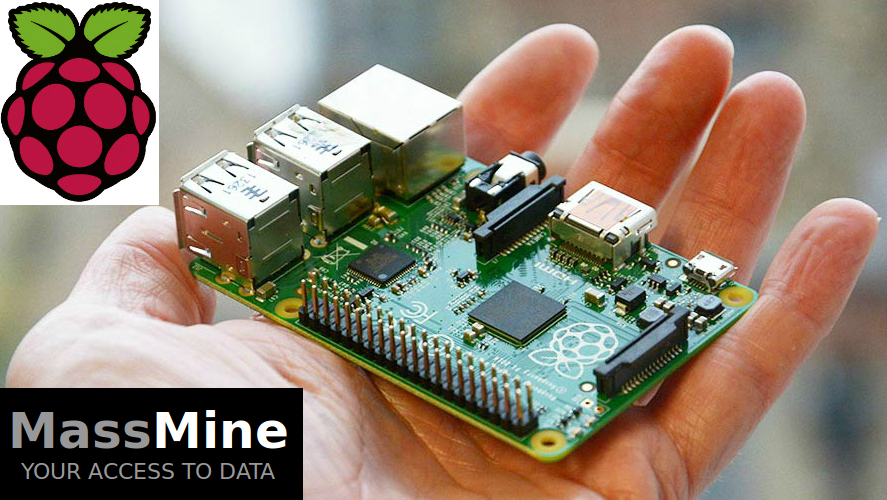
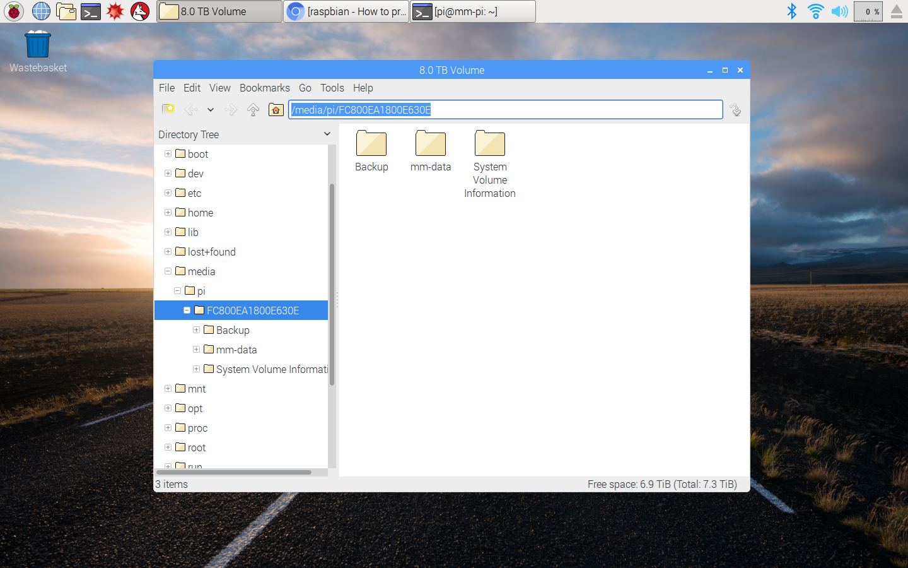
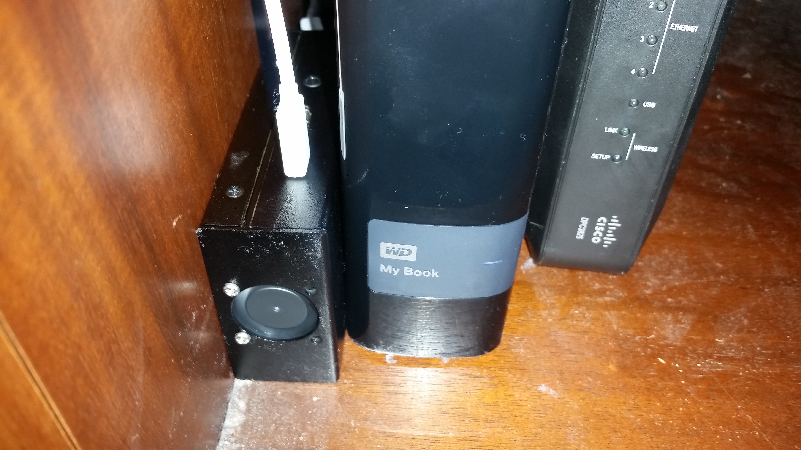

# A Dedicated MassMine Data Collection Server on a Raspberry Pi 3

by [Aaron Beveridge](http://aaronbeveridge.com/)

This tutorial shows how to install MassMine on a Raspberry Pi 3 (Rpi), how to connect a large external hard disk drive (HDD) for data storage, and how to setup the Rpi so that you can login and manage data collection from another computer (ssh). Below is a picture of my entire setup next to my router. As you can see, the external 8TB HDD and the Rpi are less than the width of my hand:

This setup is ideal for humanities and social science data labs, where researchers need to ensure that their on-going data collection efforts will not be disturbed or accidentally shutdown. Many scholars may not have the resources to dedicate an entire computer purely to data collection, and the $35 Raspberry Pi board allows for scholars to have a dedicated machine at a fraction of the cost (and energy use) of a new PC. Because MassMine requires very little computing resources to collect, compress, and archive data, connecting the Raspberry Pi to an external HDD provides the perfect alternative for long-term data collection projects. While I have purchased a very large external HDD for this project, a vast majority of long-term data collection projects with MassMine would be feasible with drives as small as 100GB. Tech savvy hackers could easily use a USB cable like [this one from Amazon](https://www.amazon.com/Cable-Matters-Drive-Adapter-Optional/dp/B00U6JEKVA/ref=sr_1_4?ie=UTF8&qid=1476149305&sr=8-4&keywords=usb+cable+for+connecting+to+HDD), and then connect it to a used HDD pulled from a broken laptop or older desktop computer.

## Getting Started

As you can see in the picture, I purchased a case with a fan ($13) for my Rpi to ensure that it stays cool and runs well long-term. This isn't necessary, as their are many options for cooling your Rpi---such as purchasing heat sinks (~$4) or simply leaving it out of the case and letting it cool in the open air. Because my Rpi would be crammed on a shelf with other electronic components that also create heat, I decided to purchase the case pictured here:

You will need to temporarily plug a monitor, keyboard, and mouse into your Rpi during installation. After the installation is finished, you will be able to login to your Rpi through ssh from other computers on your network. This means that you will be able to unplug all of these devices and control your Rpi from another computer. However, until all of that setup is finished, you will need to work with the Rpi directly.

## 1. Install the Raspbian Jessie with Pixel operating system on your Rpi

I purchased a 32GB micro SD from Walmart for ($12). Follow the instructions at URL below for installing the Raspbian operating system on the micro SD:

<https://www.raspberrypi.org/downloads/raspbian/>

## 2. Open a Terminal (ctrl-alt-t) in Raspbian, and then build MassMine from source:

After the Raspbian OS is installed on the SD card, insert the SD card into the bottom of your Rpi, and then plug in your ethernet cable (connected to your Internet router), keyboard, mouse, and monitor (HDMI). After all of these components are plugged in, then insert the power source (micro usb) into your Rpi, which will turn it on.

Using the chromium web browser provided by the Raspbian OS, go to the MassMine install page, and then scroll down to the *second* set of instructions for MassMine, titled: **Building from Source**. You will need to follow *all* of the instructions for building MassMine from source, which includes installing the programming language: Chicken Scheme. However, BEFORE beginning the MassMine install, you will need to open the Rpi terminal and type the following command:

    sudo -i

After entering the command to act as super user (sudo), navigate to the home directory by entering the following command:

    cd /home/pi

Once you are in the home directory, go to the MassMine install page located at the link below, and scroll down to **Building from Source** and follow all of the instructions.

<http://www.massmine.org/docs/install.html>

After you have built MassMine from source, enter the following command:

    ln -s `pwd`/massmine /usr/local/bin

Next, navigate back out of the MassMine directory with `cd ..`, and then test MassMine with the following command:

    massmine --task=google-country-trends

You should see JSON data printed directly to your terminal with that command---showing the top trends for each country tracked by Google. After confirming that MassMine works, exit the terminal.

## 3. Connect the External Hard Drive

Returning to the desktop of the Raspbian OS, plug in your external drive. Raspbian should recognize it automatically. In the case of the WD My Book external HDD that I chose for this project, the Raspbian OS detected it automatically and no further drivers were required. IF the external HDD that you have chosen for your project is not detected automatically, you may need to manually mount the drive through the terminal. For this tutorial, I will assume that your drive is detected as easily as mine was.

After plugging in the drive, Raspbian will ask you if you want to view the drive through the file browser. Agree and find the drive on your computer. You will need the precise location of the drive for the data collected by MassMine. For my installation of Raspbian, it placed the drive at the following location on my computer:

    /media/pi/<drive-name>

Here is a screen shot showing the file browser and the location of my drive on my Rpi:

Write down this location and save it. You will need it once you begin collecting data with MassMine.

## 4. Setup SSH on Raspbian

Open a terminal in Raspbian and follow the Instructables tutorial below. I used the instructions for setting up SSH on my Rpi. However, the second step provided in the instructions below are for Windows users only. Linux and Mac OS users will not need to follow the second step of the tutorial because Linux and Mac already have terminals with SSH installed. Simply locate the termal by opening Finder or searching for an application called `terminal`. Here are the instructions for setting up SSH on the Rpi:

<http://www.instructables.com/id/Use-ssh-to-talk-with-your-Raspberry-Pi/>

## 5. Test the Raspberry Pi Data Collection Server from Another Computer

Leave your Raspberry Pi turned on, and then unplug the monitor, keyboard, and mouse. Place it in its final position and then log into the Rpi remotely from another computer on your network. Once logged in, navigate to the external drive with the following command. Be sure to replace `<drive-name>` with the actual name that Raspbian gave to your drive:

    cd /media/pi/<drive-name>

Once you are in your external drive, test MassMine with the following command:

    massmine --task=google-country-trends --output=test.json

Type the following command to see if MassMine collected data and saved it to your drive:

    ls

If you see `test.json` listed, then your setup is complete. If you want to make sure that data was actually collected and saved to the `test.json` file, you can open the file with the following command to see its contents:

    nano test.json

That's it! Have fun with your new data collection server!

